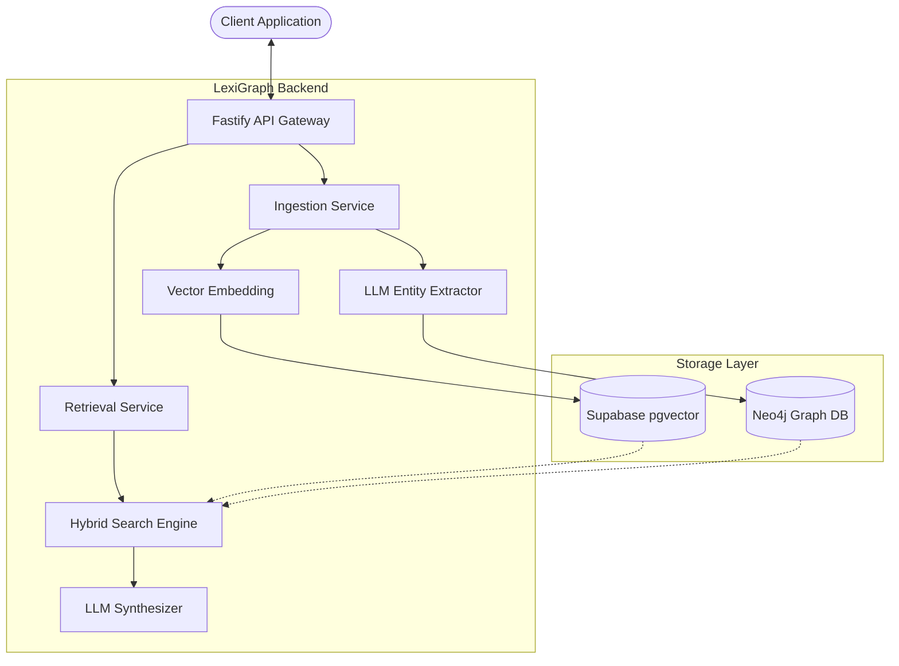
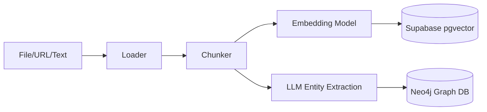
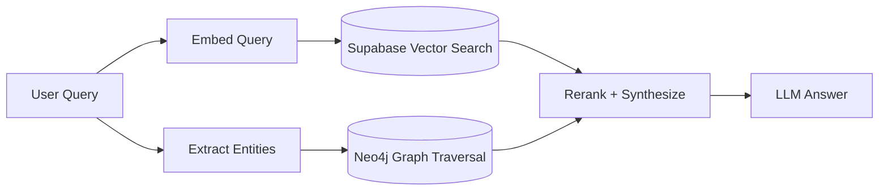

# LexiGraph

A Hybrid GraphRAG backend that combines vector semantic search with knowledge graph traversal for grounded AI responses.

[Live Demo](https://lexigraph-frontend.vercel.app)
Hang tight! The dashboard may take a few seconds to ***render***

---

## Table of Contents
- [What Problem Does This Solve?](#what-problem-does-this-solve)
- [Architecture](#architecture)
- [Key Technical Decisions](#key-technical-decisions)
- [Tech Stack](#tech-stack)
- [Features](#features)
- [Getting Started](#getting-started)
- [API Reference](#api-reference)
- [Environment Variables](#environment-variables)
- [Testing](#testing)
- [Known Limitations](#known-limitations)
- [Deployment](#deployment)
- [License](#license)

---

## What Problem Does This Solve?

Traditional RAG systems retrieve text by semantic similarity alone, missing explicit relationships between entities. LexiGraph maintains a dual-index vector embeddings for semantic meaning and a knowledge graph for structured relationships delivering more accurate, relationship-aware answers.


---

## Architecture

### Overall System Architecture


### Ingestion Pipeline


### Retrieval Pipeline


### Project Structure
```
src/
├── config/         # Neo4j, Supabase, LLM initialization
├── routes/         # API endpoint definitions + auth
├── services/       # Core logic: ingestion, retrieval, extraction
├── middleware/     # JWT auth verification
├── utils/          # Loaders, chunkers, normalizers, logger
├── db/
│   └── migrations/ # Supabase SQL migrations
└── index.ts
```

---

## Key Technical Decisions

| Decision | Alternatives Considered | Reason |
|----------|------------------------|--------|
| Hybrid GraphRAG over pure vector RAG | Pure pgvector RAG | Vector search misses explicit entity relationships |
| Supabase Auth over Auth0/Clerk | JWT from scratch | Already in stack, built-in RLS, no extra service |
| APOC for dynamic Neo4j relationships | Fixed relationship types | LLM generates relationship types at runtime |
| Zod for LLM output validation | Raw JSON parsing | LLM outputs are unpredictable, schema enforcement prevents runtime crashes |

---

## Tech Stack

| Layer | Technology |
|-------|-----------|
| Runtime | Bun |
| Framework | Fastify |
| Orchestration | LangChain.js |
| Vector DB | Supabase (pgvector) |
| Graph DB | Neo4j + APOC |
| Auth | Supabase Auth (JWT) |
| LLMs | Google Gemini, Groq (Llama-3) |
| Embeddings | HuggingFace / Gemini |
| File Parsing | PDF.js, Mammoth, Cheerio |
| Testing | Bun Test |
| CI/CD | GitHub Actions |

---

## Features

- **Multi-format ingestion** — PDF, DOCX, TXT, and web page URLs
- **Automated graph construction** — LLM extracts entities and relationships into Neo4j
- **Hybrid search** — vector similarity + graph neighbor traversal combined
- **Per-user data isolation** — Row Level Security in Supabase + userId scoping in Neo4j
- **JWT Authentication** — Supabase Auth with stateless token verification
- **Rate limiting** — via Fastify rate limiter
- **Request tracing** — unique requestId threaded through all logs
- **CI/CD** — unit tests on every push, integration tests on PRs to main

---

## Getting Started

### Prerequisites
- [Bun](https://bun.sh) installed
- A Cloud [Neo4j Aura DB](https://neo4j.com/cloud/platform/aura-graph-database/) instance
- A [Supabase](https://supabase.com) project

### 1. Clone and install
```bash
git clone https://github.com/Myash21/LexiGraph.git
cd LexiGraph
bun install
```

### 2. Environment setup
```bash
cp .env.example .env
# Fill in your values
```

### 3. Apply database migrations
Run files in `src/db/migrations/` in order via Supabase SQL editor:
- `001_initial_schema.sql`
- `002_add_user_isolation.sql`

### 4. Start the server
```bash
bun run dev
```

---

## API Reference

### Auth
| Method | Endpoint | Description | Auth Required |
|--------|----------|-------------|---------------|
| POST | `/auth/register` | Create account | No |
| POST | `/auth/login` | Login, returns JWT | No |
| POST | `/auth/refresh` | Refresh access token | No |

### Core
| Method | Endpoint | Description | Auth Required |
|--------|----------|-------------|---------------|
| GET | `/health` | Health check | No |
| POST | `/ingest` | Ingest document/URL/text | Yes |
| POST | `/query` | Hybrid search + LLM answer | Yes |
| GET | `/graph` | Get user graph | Yes |
| GET | `/documents` | Get user documents | Yes |
| DELETE | `/documents` | Delete a document and its relationships | Yes |

### Request Examples

**Login**
```bash
curl -X POST http://localhost:3000/auth/login \
  -H "Content-Type: application/json" \
  -d '{"email": "user@example.com", "password": "yourpassword"}'
```

**Ingest a file**
```bash
curl -X POST http://localhost:3000/ingest \
  -H "Authorization: Bearer <token>" \
  -F "file=@document.pdf"
```

**Ingest a URL**
```bash
curl -X POST http://localhost:3000/ingest \
  -H "Authorization: Bearer <token>" \
  -H "Content-Type: application/json" \
  -d '{"url": "https://example.com/article"}'
```

**Query**
```bash
curl -X POST http://localhost:3000/query \
  -H "Authorization: Bearer <token>" \
  -H "Content-Type: application/json" \
  -d '{"query": "What is the relationship between X and Y?"}'
```

---

## Environment Variables
```env
PORT=3000

# Neo4j (Aura DB)
NEO4J_URI=neo4j+s://<your-aura-db-id>.databases.neo4j.io
NEO4J_USER=neo4j
NEO4J_PASSWORD=your_aura_password

# Supabase
SUPABASE_URL=https://your-project.supabase.co
SUPABASE_PRIVATE_KEY=your-service-role-key
SUPABASE_SERVICE_ROLE_KEY=your-service-role-key  # Required for test cleanup only

# LLMs
GEMINI_API_KEY=your_gemini_api_key
GROQ_API_KEY=your_groq_api_key
```

---

## Testing
```bash
bun run test:unit          # Runs on every push
bun run test:integration   # Runs on PRs to main
bun run test               # All tests
```

### What's tested
- **Unit:** Canonicalization and normalization edge cases
- **Integration:** Full pipeline — auth → ingest → graph storage → 
  query → retrieval, plus cross-user isolation verification

---

## Known Limitations

- Graph nodes are fully isolated per user — cross-user knowledge sharing is not supported by design.
- `match_threshold` of 0.5 is a fixed default — adaptive thresholding based on query type would improve retrieval quality.
- No persistent chat history — each query is stateless.

## Deployment

- The backend is deployed on Render while the frontend is deployed on Vercel.
- The backend may take a few seconds to load on the first request due to the free tier.
- You can access the frontend repository [here](https://github.com/Myash21/Lexigraph-frontend)

---

## License
[](https://opensource.org/licenses/MIT)
