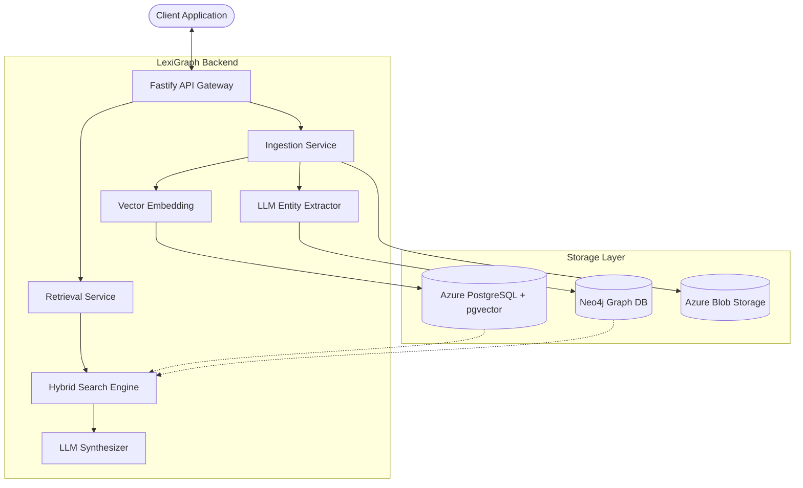
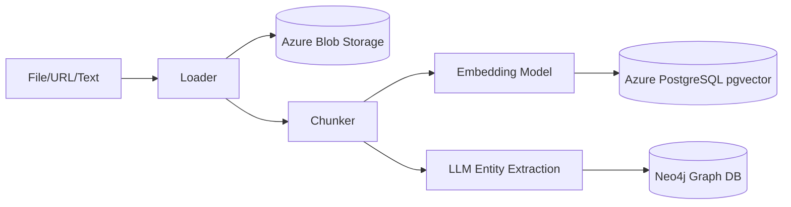
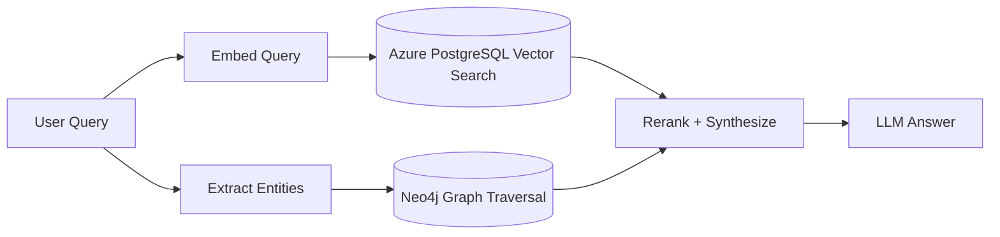

# LexiGraph

A Hybrid GraphRAG backend that combines vector semantic search with knowledge graph traversal for grounded AI responses.

[Live Demo](https://lexigraph-frontend.vercel.app)

login email: testuser123@gmail.com
login password: 12345678
---

## Table of Contents
- [What Problem Does This Solve?](#what-problem-does-this-solve)
- [Architecture](#architecture)
- [Key Technical Decisions](#key-technical-decisions)
- [Tech Stack](#tech-stack)
- [Features](#features)
- [Getting Started](#getting-started)
- [API Reference](#api-reference)
- [Environment Variables](#environment-variables)
- [Testing](#testing)
- [Known Limitations](#known-limitations)
- [Deployment](#deployment)
- [License](#license)

---

## What Problem Does This Solve?

Traditional RAG systems retrieve text by semantic similarity alone, missing explicit relationships between entities. LexiGraph maintains a dual-index — vector embeddings for semantic meaning and a knowledge graph for structured relationships — delivering more accurate, relationship-aware answers.


---

## Architecture

### Overall System Architecture

```mermaid
flowchart TD
    Client([Client Application]) <--> API[Fastify API Gateway]

    subgraph Services [LexiGraph Backend]
        API --> Ingest[Ingestion Service]
        API --> Query[Retrieval Service]

        Ingest --> Embed[Vector Embedding]
        Ingest --> Extractor[LLM Entity Extractor]

        Query --> Search[Hybrid Search Engine]
        Search --> Synthesizer[LLM Synthesizer]
    end

    subgraph Data [Storage Layer]
        Embed --> VDB[(Azure PostgreSQL + pgvector)]
        Extractor --> GDB[(Neo4j Graph DB)]
        Ingest --> BLOB[(Azure Blob Storage)]

        VDB -.-> Search
        GDB -.-> Search
    end
```

### Ingestion Pipeline

```mermaid
flowchart LR
    A[File/URL/Text] --> B[Loader]
    B --> BLOB[(Azure Blob Storage)]
    B --> C[Chunker]
    C --> D[Embedding Model]
    C --> E[LLM Entity Extraction]
    D --> F[(Azure PostgreSQL pgvector)]
    E --> G[(Neo4j Graph DB)]
```

### Retrieval Pipeline

```mermaid
flowchart LR
    A[User Query] --> B[Embed Query]
    A --> C[Extract Entities]
    B --> D[(Azure PostgreSQL Vector Search)]
    C --> E[(Neo4j Graph Traversal)]
    D --> F[Rerank + Synthesize]
    E --> F
    F --> G[LLM Answer]
```

### Project Structure
```
src/
├── config/         # Neo4j, Azure PostgreSQL, Azure Blob Storage, LLM initialization
├── routes/         # API endpoint definitions + auth
├── services/       # Core logic: ingestion, retrieval, extraction, deletion
├── middleware/     # JWT auth verification
├── utils/          # Loaders, chunkers, normalizers, logger
├── db/
│   └── migrations/ # PostgreSQL migrations (run in order)
└── index.ts
```

---

## Key Technical Decisions

| Decision | Alternatives Considered | Reason |
|----------|------------------------|--------|
| Hybrid GraphRAG over pure vector RAG | Pure pgvector RAG | Vector search misses explicit entity relationships |
| Azure PostgreSQL + pgvector over Supabase | Supabase, Pinecone | Full Azure integration, same pgvector extension, no vendor lock-in beyond cloud |
| Azure Blob Storage for file uploads | In-memory / local disk | Durable storage, enables re-ingestion, audit trail, scales with Container Apps |
| Azure Container Apps over Render | Render, Railway | No cold starts on scale-to-zero, native Azure ecosystem, Docker-native |
| Self-signed JWT (HS256) over Supabase Auth | Supabase Auth, Auth0 | No external auth dependency, works with any email, full control over token shape |
| APOC for dynamic Neo4j relationships | Fixed relationship types | LLM generates relationship types at runtime |
| Zod for LLM output validation | Raw JSON parsing | LLM outputs are unpredictable; schema enforcement prevents runtime crashes |

---

## Tech Stack

| Layer | Technology |
|-------|-----------|
| Runtime | Bun |
| Framework | Fastify |
| Orchestration | LangChain.js |
| Vector DB | Azure Database for PostgreSQL (Flexible Server) + pgvector |
| File Storage | Azure Blob Storage |
| Graph DB | Neo4j Aura + APOC |
| Auth | Self-signed JWT (HS256) with bcrypt password hashing |
| Container Registry | Azure Container Registry (ACR) |
| Hosting | Azure Container Apps |
| LLMs | Google Gemini, Groq (Llama-3) |
| Embeddings | HuggingFace (all-MiniLM-L6-v2, 384-dim) |
| File Parsing | PDF.js, Mammoth, Cheerio |
| Testing | Bun Test |
| CI/CD | GitHub Actions → Azure Container Apps |

---

## Features

- **Multi-format ingestion** — PDF, DOCX, TXT, and web page URLs
- **Azure Blob Storage** — uploaded files stored durably before processing, enabling re-ingestion and audit trail
- **Automated graph construction** — LLM extracts entities and relationships into Neo4j
- **Hybrid search** — vector similarity + graph neighbour traversal combined
- **Per-user data isolation** — Row Level Security in PostgreSQL + userId scoping in Neo4j
- **JWT Authentication** — self-signed HS256 tokens, email/password register + login
- **Rate limiting** — via Fastify rate limiter
- **Request tracing** — unique requestId threaded through all logs
- **CI/CD** — unit tests on every push, integration tests on PRs, auto-deploy to Azure on merge to main

---

## Getting Started

### Prerequisites
- [Bun](https://bun.sh) installed
- [Docker Desktop](https://www.docker.com/products/docker-desktop/) installed
- A Cloud [Neo4j Aura DB](https://neo4j.com/cloud/platform/aura-graph-database/) instance
- An [Azure account](https://azure.microsoft.com/free) with the following resources provisioned:
  - Azure Database for PostgreSQL — Flexible Server (B1ms, pgvector extension enabled)
  - Azure Blob Storage account
  - Azure Container Registry
  - Azure Container Apps environment

### 1. Clone and install
```bash
git clone https://github.com/Myash21/LexiGraph.git
cd LexiGraph
bun install
```

### 2. Environment setup
```bash
cp .env.example .env
# Fill in your values — see Environment Variables section below
```

### 3. Apply database migrations
Connect to your Azure PostgreSQL instance and run the migration files in order:

```bash
psql "host=<your-server>.postgres.database.azure.com dbname=lexigraph user=<admin-user> sslmode=require" \
  -f src/db/migrations/001_initial_schema.sql \
  -f src/db/migrations/002_match_documents_function.sql \
  -f src/db/migrations/003_users_table.sql
```

### 4. Start the server
```bash
bun run dev
```

### 5. Deploy to Azure Container Apps
```bash
# Login
az login
az acr login --name <your-acr-name>

# Build and push
docker build -t <your-acr>.azurecr.io/lexigraph-backend:latest .
docker push <your-acr>.azurecr.io/lexigraph-backend:latest
```

Then create a new revision in Azure Container Apps pointing to the new image.

---

## API Reference

### Auth
| Method | Endpoint | Description | Auth Required |
|--------|----------|-------------|---------------|
| POST | `/auth/register` | Create account, returns tokens | No |
| POST | `/auth/login` | Login, returns tokens | No |
| POST | `/auth/refresh` | Exchange refresh token for new access token | No |
| GET | `/auth/me` | Return current user identity | Yes |

### Core
| Method | Endpoint | Description | Auth Required |
|--------|----------|-------------|---------------|
| GET | `/health` | Health check | No |
| POST | `/ingest` | Ingest document/URL/text | Yes |
| POST | `/query` | Hybrid search + LLM answer | Yes |
| GET | `/graph` | Get user knowledge graph | Yes |
| GET | `/documents` | Get user documents | Yes |
| DELETE | `/documents` | Delete a document and its graph relationships | Yes |

### Request Examples

**Register**
```bash
curl -X POST http://localhost:3000/auth/register \
  -H "Content-Type: application/json" \
  -d '{"email": "user@example.com", "password": "yourpassword", "name": "Your Name"}'
```

**Login**
```bash
curl -X POST http://localhost:3000/auth/login \
  -H "Content-Type: application/json" \
  -d '{"email": "user@example.com", "password": "yourpassword"}'
```

**Ingest a file**
```bash
curl -X POST http://localhost:3000/ingest \
  -H "Authorization: Bearer <token>" \
  -F "file=@document.pdf"
```

**Ingest a URL**
```bash
curl -X POST http://localhost:3000/ingest \
  -H "Authorization: Bearer <token>" \
  -H "Content-Type: application/json" \
  -d '{"url": "https://example.com/article"}'
```

**Query**
```bash
curl -X POST http://localhost:3000/query \
  -H "Authorization: Bearer <token>" \
  -H "Content-Type: application/json" \
  -d '{"query": "What is the relationship between X and Y?"}'
```

---

## Environment Variables

```env
PORT=3000

# Neo4j Aura DB
NEO4J_URI=neo4j+s://<your-aura-db-id>.databases.neo4j.io
NEO4J_USER=neo4j
NEO4J_PASSWORD=your_aura_password

# Azure Database for PostgreSQL (Flexible Server)
AZURE_PG_HOST=<your-server>.postgres.database.azure.com
AZURE_PG_PORT=5432
AZURE_PG_DATABASE=lexigraph
AZURE_PG_USER=<your-admin-username>
AZURE_PG_PASSWORD=your_pg_password

# Azure Blob Storage
AZURE_STORAGE_CONNECTION_STRING=DefaultEndpointsProtocol=https;AccountName=...;AccountKey=...
AZURE_STORAGE_CONTAINER=lexigraph-uploads

# Azure Entra ID (App Registration — used for Container App identity)
AZURE_TENANT_ID=xxxxxxxx-xxxx-xxxx-xxxx-xxxxxxxxxxxx
AZURE_CLIENT_ID=xxxxxxxx-xxxx-xxxx-xxxx-xxxxxxxxxxxx

# JWT Auth — generate with: openssl rand -base64 32
JWT_SECRET=your_strong_random_secret_here

# LLMs
GEMINI_API_KEY=your_gemini_api_key
GROQ_API_KEY=your_groq_api_key
```

---

## Testing
```bash
bun run test:unit          # Runs on every push
bun run test:integration   # Runs on PRs to main
bun run test               # All tests
```

### What's tested
- **Unit:** Canonicalization and normalization edge cases
- **Integration:** Full pipeline — register → login → ingest → graph storage → query → retrieval, plus cross-user isolation verification

---

## Known Limitations

- Graph nodes are fully isolated per user — cross-user knowledge sharing is not supported by design.
- `match_threshold` of 0.5 is a fixed default — adaptive thresholding based on query type would improve retrieval quality.
- No persistent chat history — each query is stateless.
- Embedding model produces 384-dim vectors (all-MiniLM-L6-v2) — switching models requires a schema migration and re-ingestion of all documents.

---

## Deployment

- Backend is deployed on **Azure Container Apps** (Central India region)
- Frontend is deployed on **Vercel**
- CI/CD via **GitHub Actions** — unit tests on push, integration tests on PRs, auto-deploy to Azure on merge to main
- You can access the frontend repository [here](https://github.com/Myash21/Lexigraph-frontend)

---

## License
[](https://opensource.org/licenses/MIT)